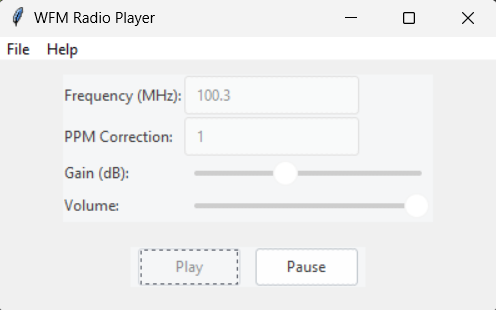

# sdr-player
RTL-SDR WFM audio player using [pyrtlsdr](https://github.com/pyrtlsdr/pyrtlsdr)

The goal of this project is largely unknown at this time. My aim is to learn and grow my SDR knowledge. Expect lots of bugs and missing features.

## Install

### Windows
A compiled Windows version is available for download in the [latest release](https://github.com/mpsparrow/sdr-player/releases/latest).

### Manual
Having a working [pyrtlsdr](https://github.com/pyrtlsdr/pyrtlsdr) installation with `librtlsdr` files in place. Connect a RTL-SDR dongle to your system with the proper drivers. Run `main.py`.
